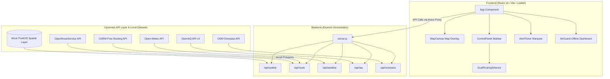

# 🛡️ Path OS: Climate-Aware Urban Navigation System

[](#)
[](#)
[](#)
[](#)

Path OS is a full-stack, climate-resilient urban navigation dashboard. The platform orchestrates real-time environmental APIs with static datasets to calculate commuter routing, prioritizing ecological safety and shielding commuters from extreme weather, smog boundaries, high-decibel zones, and urban floodings.

---

## 🗺️ System Architecture

Path OS acts as a client-side Crisis Command HUD and an orchestration backend that bridges public geodata interfaces with localized environmental matrices:



---

## 📌 Table of Contents

- [🌟 Key Core Features](#-key-core-features)
- [🛠️ Technology Stack](#️-technology-stack)
- [📂 Project Structure](#-project-structure)
- [🚀 Getting Started](#-getting-started)
- [🔌 API Endpoint Reference Matrix](#-api-endpoint-reference-matrix)
- [🧠 Deep Dive: Environmental Sub-systems](#-deep-dive-environmental-sub-systems)
- [🔑 Environment Variables & Security Configuration](#-environment-variables--security-configuration)
- [📄 License](#-license)

---

## 🌟 Key Core Features

### 1. Operator Authorization & Lock
A secure workspace access manager enforcing credential authentication. Commuter operators must authenticate before gaining access to the Crisis Command dashboard.

### 2. Dual-Mode Routing Engine
Routes can be plotted between two addresses using either:
*   **Pulse (Fastest Route)**: Utilizing OSRM API for rapid, traffic-centric driving routes.
*   **Haven (Safe Route)**: Dynamic route mapping through OpenRouteService (ORS). Instructs ORS to avoid spatial danger hazards (e.g., knee-/chest-deep flooding, high-decibel corridors) by converting threat polygons into avoided routing geometry boundaries.

### 3. Spatial Hazard Layers
*   **💨 AirGuard (Smog Coverage)**: Real-time AQI tracking (via US EPA breakpoints) using US-EPA PM2.5 sensors with animated, translucent smog layers.
*   **🌧️ Monsoon Matrix (Flood Risk)**: Dynamic rain gauge metrics integrated with flood zone safety vectors.
*   **☀️ ShadeSeeker (Solar Shadows)**: Interactive solar azimuth calculator fetching building footprints and heights from the OSM Overpass API to display shadows depending on the selected hour of the day.
*   **🔊 NavQuiet (Acoustic Corridors)**: Decibel contour maps identifying serene zones and heavy noise corridors to maximize comfort.

### 4. Alert & Context Center
*   **AlertTicker**: A scrolling marquee detailing emergency ecological constraints (e.g. hazardous PM2.5 levels, storm warnings, or routing status).
*   **Live Clock**: A localized clock panel (`en-IN` timezone formatting) for operational timekeeping.
*   **AirGuard Offline Fail-Safe**: A full-viewport compass interface that triggers when Internet connectivity is lost, displaying direction and cached coordinates for the nearest emergency shelters.

---

## 🛠️ Technology Stack

*   **Frontend**: React 18, Vite, Leaflet & React Leaflet (Map visualization), LocalForage (Offline caching), Tailwind CSS
*   **Backend**: Node.js, Express, Axios (Upstream client requests), Dotenv
*   **External APIs**:
    *   OSRM (Open Source Routing Machine) — Free route solver
    *   OpenRouteService (ORS) — Free multi-criteria routing
    *   Open-Meteo — Hourly and historical weather forecasts
    *   OpenAQ — Public air quality dataset monitoring
    *   OpenStreetMap (Nominatim & Overpass query engine) — Location search & geodata

---

## 📂 Project Structure

```text
Path OS/
├── backend/
│   ├── data/                 # Spatial GeoJSON datasets (flood, noise, serene, smog, shelters)
│   ├── routes/
│   │   ├── aqi.js            # OpenAQ wrapper + US EPA AQI calculator
│   │   ├── overpass.js       # Overpass API building coordinates & heights parser
│   │   ├── routing.js        # Dual-mode router (pulse vs haven)
│   │   └── weather.js        # Weather metrics using Open-Meteo
│   ├── server.js             # Express app setup and middleware definition
│   └── package.json
└── frontend/
    ├── src/
    │   ├── components/       # UI dashboard layers (AirGuard, ShadeSeeker, NavQuiet, Login, etc.)
    │   ├── hooks/            # Custom hooks (e.g., useOnlineStatus for offline trigger)
    │   ├── services/         # Axios api request controllers
    │   ├── App.jsx           # Main state management and orchestration
    │   ├── index.css         # Custom maps, panels, and ticker animations
    │   └── main.jsx
    ├── tailwind.config.js
    ├── vite.config.js
    └── package.json
```

---

## 🚀 Getting Started

Follow these steps to setup Path OS in your local workspace.

### Prerequisites
*   **Node.js**: `v16.x` or newer
*   **npm**: `v8.x` or newer

### Installation

1.  **Clone down the application** to your local project folder.
2.  **Install development packages for the backend**:
    ```bash
    cd backend
    npm install
    ```
3.  **Install dependencies for the frontend**:
    ```bash
    cd ../frontend
    npm install
    ```

### Execution

To run Path OS, spin up the backend and frontend dev environments concurrently in two separate terminal windows:

*   **Terminal 1 (Backend)**:
    ```bash
    cd backend
    npm run dev
    ```
    The backend server will launch on `http://localhost:3001` (configuration variables log automatically on start).
*   **Terminal 2 (Frontend)**:
    ```bash
    cd frontend
    npm run dev
    ```
    The Vite dev server will boot up and establish the frontend on `http://localhost:5173`. Open your browser to view the login interface!

---

## 🔌 API Endpoint Reference Matrix

The backend orchestrates intermediate API connections to avoid CORS issues and coordinates regional proxies:

| Endpoint | Method | Key Parameters | Return Data Details | Fail-Safe & Fallback Behavior |
| :--- | :---: | :--- | :--- | :--- |
| `/api/health` | `GET` | None | Returns JSON describing server status, timestamp, and version. | Standard Express 500 boundary returns error message. |
| `/api/spatial` | `GET` | None | Returns complete mock PostGIS collections (`floodZones`, `noiseCorridors`, `sereneZones`, `smogZones`, `emergencyShelters`). | Reads from native `spatialData.js` offline database file. |
| `/api/route` | `POST` | `origin` (Array `[lng, lat]`), `destination` (Array `[lng, lat]`), `mode` (`"pulse"`/`"haven"`) | GeoJSON path geometry coordinates, duration in minutes, distance in km, and computed `empathyScore` metadata. | Haven mode intercepts errors and falls back to OSRM (unprotected route) setting `fallbackUsed: true`. |
| `/api/weather` | `GET` | `lat` (Float), `lon` (Float) | Temp, wind speed, precipitation, raining status, and weather code condition descriptive string. | Gracefully handles Open-Meteo failures: returns cached 34°C mock dataset setting `fallback: true`. |
| `/api/aqi` | `GET` | `lat` (Float), `lon` (Float) | PM2.5, PM10, AQI index score, label validation (Good/Unhealthy), hex colors, and station name. | Gracefully handles OpenAQ failures: returns a mock dataset from New Delhi station setting `fallback: true`. |
| `/api/overpass` | `GET` | `bbox` (south,west,north,east) | Array of JSON elements detailing building polygon coordinate arrays, heights, and coordinates of trees. | Gracefully handles Overpass API rate-limit errors: returns local mock buildings in Delhi setting `fallback: true`. |

---

## 🧠 Deep Dive: Environmental Sub-systems

### 1. US-EPA Air Quality Indexing (AirGuard)
The system pulls local PM2.5 measurements from monitoring stations. It runs the raw measurements through standard US-EPA breakpoint curves:
$$I = \frac{I_{high} - I_{low}}{C_{high} - C_{low}} \times (C - C_{low}) + I_{low}$$
The resulting index assigns visual colors:
*   🟢 **0–50**: Good
*   🟡 **51–100**: Moderate
*   🟠 **101–150**: Unhealthy for Sensitive Groups
*   🔴 **151–200**: Unhealthy
*   🟣 **201–300**: Very Unhealthy
*   🟤 **301+**: Hazardous (Triggers Metro alternate suggestion recommendations)

### 2. ShadeSeeker Shadow Geometry
Inputs from coordinate boundaries are queried through Overpass. The backend extracts `height` and `building:levels` tags. The React frontend computes vector projections for building footprints:
*   Calculates solar azimuth and elevation angles depending on time.
*   Projects building corners into shadow coordinates based on structural height.
*   Paints translucent shadow canvases layer polygons on top of the Leaflet coordinate space.

---

## 🔑 Environment Variables & Security Configuration

Ensure that security policies are anchored appropriately.
Configure a `.env` file in the root `backend` folder to customize runtime endpoints:

```properties
# Backend Port Configuration
PORT=3001
```

### CORS Policies
The backend includes CORS locks to secure the orchestrator:
*   White-listed Origins: Dev servers (`http://localhost:5173`, `http://localhost:3000`), Anchored production domains (e.g. `*.vercel.app`, `*.netlify.app` regex matches).
*   Permitted Methods: `GET`, `POST` endpoints exclusively.

---

## 📄 License

This project is licensed under the MIT License - see the LICENSE details for terms.
